# 数组

## 704. 二分查找

* 题目表述

```
在有序数组中找目标值，返回数组下标
```

* 思路

```
双指针，最左和最右
固定左闭右开->
int left = 0;
int right = nums.length;
```

```java
//[left,right)

class Solution {
    public int search(int[] nums, int target) {
        if(target<nums[0] || target>nums[nums.length-1]){
            return -1;
        }
        int left = 0;
        int right = nums.length;
        
        while(left<right){
            int m =(left + right)/2;
            //int m = left + ((right - left) >> 1);右移运算代替整除
            if(target==nums[m]){
                return m;
            }else if(target<nums[m]){
                right = m;
            }else{
                left = m+1;
            }
        }
        return -1;
    }
}
```

- 时间复杂度：O(log n)
- 空间复杂度：O(1)

## 27.移除元素

```Java
class Solution {
    public int removeElement(int[] nums, int val) {
        int slow = 0;
        for(int fast = 0;fast<nums.length;fast++){
            if(nums[fast]!=val){
                nums[slow]=nums[fast];
                slow++;
            }
        }
        return slow;
    }
}
```

- 时间复杂度：O(n)
- 空间复杂度：O(1)

## 977. 有序数组的平方

思路：核心是数组是有序的，则平方后最大值不是在最左边就是最右边，不可能在中间

```java
class Solution {
    public int[] sortedSquares(int[] nums) {
        int i = 0;
        int j = nums.length-1;
        int k = nums.length-1;
        int[] res = new int[nums.length];
        while(k>=0){
            if(nums[i]*nums[i]>=nums[j]*nums[j]){
                res[k]=nums[i]*nums[i];
                i++;
            }else{
                res[k]=nums[j]*nums[j];   
                j--;
            }
            k--;
        }
        return res;
    }
}
```

- 时间复杂度：O(n)
- 空间复杂度：O(n)

## 209. 长度最小的子数组

方法：双指针（滑动窗口，用两个循环语句实现，能确定始终的优先用for，只知道终止条件的用while）

```java
class Solution {
    public int minSubArrayLen(int target, int[] nums) {
        int start = 0;
        int sum = 0;
        int r = Integer.MAX_VALUE;
        for(int end = 0;end<nums.length;end++){
            sum += nums[end];
            while(sum>=target){
                r = Math.min(r,end-start+1);
                sum = sum - nums[start];
                start++;
            }                 
        }
        return r == Integer.MAX_VALUE ? 0 : r;
    }
}
```

- 时间复杂度：O(n)
- 空间复杂度：O(1)

**为什么时间复杂度是O(n)**。

不要以为for里放一个while就以为是O(n^2)啊， 主要是看每一个元素被操作的次数，每个元素在滑动窗后进来操作一次，出去操作一次，每个元素都是被操作两次，所以时间复杂度是 2 × n 也就是O(n)。


# 矩阵

## lc.73 矩阵置零

```java
class Solution {
    public void setZeroes(int[][] matrix) {
        int m = matrix.length;
        int n = matrix[0].length;
        
        boolean r0 = false, c0 = false;
        // 1. 扫描「首行」和「首列」记录「首行」和「首列」是否该被置零
        for (int j = 0; j < n; j++) {
            if (matrix[0][j] == 0) {
                r0 = true;
                break;
            }
        }
        for (int i = 0; i < m; i++) {
            if (matrix[i][0] == 0) {
                c0 = true;
                break;
            }
        }
        // 2.1 扫描「非首行首列」的位置，如果发现零，将需要置零的信息存储到该行的「最左方」和「最上方」的格子内
        for (int i = 1; i < m; i++) {
            for (int j = 1; j < n; j++) {
                if (matrix[i][j] == 0)
                    matrix[i][0] = matrix[0][j] = 0;
            }
        }
        // 2.2 根据刚刚记录在「最左方」和「最上方」格子内的置零信息，进行「非首行首列」置零
        for (int j = 1; j < n; j++) {
            if (matrix[0][j] == 0) {
                for (int i = 1; i < m; i++)
                    matrix[i][j] = 0;
            }
        }
        for (int i = 1; i < m; i++) {
            if (matrix[i][0] == 0)
                Arrays.fill(matrix[i], 0);
        }
        // 3. 根据最开始记录的「首行」和「首列」信息，进行「首行首列」置零
        if (c0)
            for (int i = 0; i < m; i++)
                matrix[i][0] = 0;
        if (r0)
            Arrays.fill(matrix[0], 0);
    }
}
```


## 59. 螺旋矩阵Ⅱ

```java
class Solution {
    public int[][] generateMatrix(int n) {
        int count = 1;//设置元素用
        int i = 0;//行索引
        int j = 0;//列索引
        int start = 0;
        int end = n-1;//依据左闭右开，每个边设n-1个元素
        int x = n/2; //圈数
        int[][] res = new int[n][n];
        while(x > 0){
            for(;j<end;j++){//行不变，列变
                res[i][j]=count++;
            }
            for(;i<end;i++){//行变，列变
                res[i][j]=count++;
            }
            for(;j>start;j--){
                res[i][j]=count++;
            }
            for(;i>start;i--){
                res[i][j]=count++;
            }
            x--;i++;j++;end--;start++; //除了count外，其他五个变量均需要加减操作，(i,j, start:加；                                                                                end,x:减)
        }
        //如果n为奇
        if(n%2!=0){
            res[n/2][n/2]=n*n;
        }
        return res;
    }
}
```


# String

## 541. 反转字符串Ⅱ

```java
class Solution {
    public String reverseStr(String s, int k) {
        char[] ch = s.toCharArray();
        for(int i = 0;i < ch.length;i += 2 * k){
            int start = i;
            // 判断尾数够不够k个来取决end指针的位置
            int end = Math.min(ch.length - 1,start + k - 1);
            while(start < end){
                
                char temp = ch[start];
                ch[start] = ch[end];
                ch[end] = temp;
                start++;
                end--;
            }
        }
        return new String(ch);
    }
}
```

## 卡码网 54. 替换数字

```java
import java.util.Scanner;

class Main {
    public static void main(String[] args) {
        Scanner in = new Scanner(System.in);
        String s = in.nextLine();
        StringBuilder sb = new StringBuilder();
        for (int i = 0; i < s.length(); i++) {
            if (Character.isDigit(s.charAt(i))) {
                sb.append("number");
            }else sb.append(s.charAt(i));
        }
        System.out.println(sb);
    }
}
```

## 151. 反转字符串中的单词

思路：

- 移除多余空格
- 将整个字符串反转
- 将每个单词反转

```Java
class Solution {
    public String reverseWords(String s) {
        StringBuilder sb = removeSpace(s);//删除多余空格
        reverseString(sb, 0, sb.length() - 1);//反转整个字符串
        reverseEachWord(sb);//反转单词
        return sb.toString();

    }
    private StringBuilder removeSpace(String s){
        int start = 0;
        int end = s.length() - 1;
        while(s.charAt(start) == ' '){
            start++;
        }
        while(s.charAt(end) == ' '){
            end--;
        }
        StringBuilder sb = new StringBuilder();
        while(start<=end){
            char ch = s.charAt(start);

            //神之一笔
            if(ch != ' ' || sb.charAt(sb.length()-1)!=' '){
                sb.append(ch);
            }
            start++;
        }
        return sb;
    }

    public void reverseString(StringBuilder sb, int start, int end) {
       //setCharAt方法
        while (start < end) {
            char temp = sb.charAt(start);
            sb.setCharAt(start, sb.charAt(end));
            sb.setCharAt(end, temp);
            start++;
            end--;
        }
    }
    private void reverseEachWord(StringBuilder sb){
        int slow = 0;
        for(int fast = 0;fast<=sb.length();fast++){

            //此处逻辑运算符左右不可颠倒！！！
            if(fast==sb.length() || sb.charAt(fast)==' '){
                reverseString(sb,slow,fast-1);
                slow = fast+1;
            }
        }
    }    
}
```

## KMP

**前缀是指不包含最后一个字符的所有以第一个字符开头的连续子串**

**后缀是指不包含第一个字符的所有以最后一个字符结尾的连续子串**


```java
//next函数模板
private int[] getNext(String p){
    int[] next = new int[p.length()];
    int j = -1;
    next[0] = j;
    for(int i =1;i<p.length();i++){
        while(j>=0 && p.charAt(i) != p.charAt(j+1)){
            j = next[j];
        }
        if(p.charAt(i)==p.charAt(j+1)){
            j++;
        }
        next[i] = j;
    }    
}
```


## lc.28 找出字符串中第一个匹配项的下标（KMP）

```Java
class Solution {
    public int strStr(String haystack, String needle) {
        int[] next = getNext(needle);
        int j =-1;
        for(int i =0;i<haystack.length();i++){
            while(j>=0 && haystack.charAt(i) != needle.charAt(j+1)){
                j = next[j];
            }
            if(haystack.charAt(i) == needle.charAt(j+1)){
                j++;
            }
            if(j==needle.length()-1){
                return (i-needle.length()+1);
            }
        }
        return -1;
    }
    private int[] getNext(String p){
        int[] next = new int[p.length()];
        int j = -1;
        next[0] = j;
        for(int i =1;i<p.length();i++){
            while(j>=0 && p.charAt(i) != p.charAt(j+1)){
                j = next[j];
            }
            if(p.charAt(i)==p.charAt(j+1)){
                j++;
            }
            next[i] = j;
        }
        return next;    
    }
}
```

## lc.459 重复的子字符串（kmp）

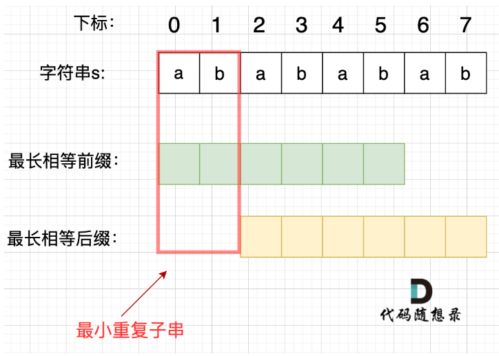

*  如果 next[len - 1] != -1，则说明字符串有最长相同的前后缀，最长相等前后缀的长度为：next[len - 1] + 1
* 如果len % (len - (next[len - 1] + 1)) == 0 ，则说明数组的长度正好可以被 (next数组长度-最长相等前后缀的长度) 整除 ，说明该字符串有重复的子字符串。

如下：

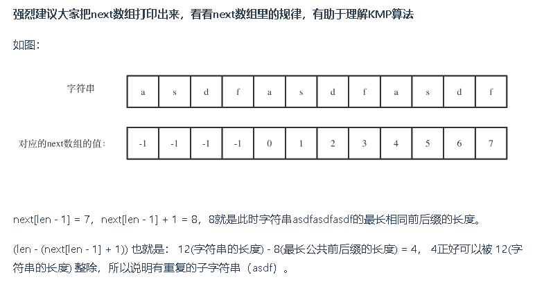


```Java
class Solution {
    public boolean repeatedSubstringPattern(String s) {
        int[] next = getNext(s);
        int len = s.length();
        if (next[len - 1] != -1 && len % (len - (next[len - 1] +1)) == 0) {
            return true;
        }
        return false;      
    }
    private int[] getNext(String p){
        int[] next = new int[p.length()];
        int j = -1;
        next[0] = j;
        for(int i =1;i<p.length();i++){
            while(j>=0 && p.charAt(i) != p.charAt(j+1)){
                j = next[j];
            }
            if(p.charAt(i)==p.charAt(j+1)){
                j++;
            }
            next[i] = j;
        }
        return next;    
    }
}
```


# 哈希表

当我们需要查询一个元素是否出现过，或者一个元素是否在集合里的时候，就要第一时间想到哈希法。

## 242. 有效的字母异位词

```java
class Solution {
    public boolean isAnagram(String s, String t) {
        int[] record = new int[26];
        for(int i = 0;i < s.length();i++){
            record[s.charAt(i)-'a']++;
        }
        for(int i = 0;i < t.length();i++){
            record[t.charAt(i)-'a']--;
        }
        for(int count : record){
            if(count != 0){
                return false;
            }
        }
        return true;
    }
}
```

## 338. 赎金信

```java
class Solution {
    public boolean canConstruct(String ransomNote, String magazine) {
        int[] record = new int[26];
        for(char c : magazine.toCharArray()){
            record[c - 'a'] += 1;
        }
        for(char c : ransomNote.toCharArray()){
            record[c - 'a'] -= 1;
        }
        for(int i : record){
            if(i < 0){
                return false;
            }
        }
        return true;
    }
}
```

## 49. 字母异位词分组

```java
class Solution {
    public List<List<String>> groupAnagrams(String[] strs) {
        HashMap<String, List<String>> map = new HashMap<>();
        for(int i =0 ;i<strs.length;i++){
            char[] str = strs[i].toCharArray();
            Arrays.sort(str);
            String key = new String(str);
            if(map.containsKey(key)){
                map.get(key).add(strs[i]);
            }else{
                List<String> list = new ArrayList<>();
                list.add(strs[i]);
                map.put(key,list);
            }
        }
        return new ArrayList<>(map.values());
    }
}
```


## 438. 找到字符串中所有字母异位词

## 349. 两个数组的交集🤷‍♂️

```Java
class Solution {
    public int[] intersection(int[] nums1, int[] nums2) {
        if (nums1 == null ||  nums2 == null ) {
            return new int[0];
        }
        Set<Integer> set1 = new HashSet<>();
        Set<Integer> resSet = new HashSet<>();
        //遍历数组1
        for (int i : nums1) {
            set1.add(i);
        }
        //遍历数组2的过程中判断哈希表中是否存在该元素
        for (int i : nums2) {
            if (set1.contains(i)) {
                resSet.add(i);
            }
        }      
       
        //另外申请一个数组存放setRes中的元素,最后返回数组
        int[] arr = new int[resSet.size()];
        int j = 0;
        for(int i : resSet){
            arr[j++] = i;
        }   
        return arr;
    }
}
```


## 350. 两个数组的交集Ⅱ

1.循环nums1数组，每个元素的值做为key，nums1数组中出现的次数作为value
2.再循环nums2数组去map中取，取出来让value-1，然后放入List中
3.将list转换为数组并返回

```java
class Solution {
    public int[] intersect(int[] nums1, int[] nums2) {
        Map<Integer,Integer> map=new HashMap<>();
        List<Integer> list=new ArrayList<>();
        for(int i=0;i<nums1.length;i++){
            map.put(nums1[i],map.getOrDefault(nums1[i], 0)+1);
        }
        for(int i=0;i<nums2.length;i++){
            if(map.getOrDefault(nums2[i],0)!=0){
                list.add(nums2[i]);
                map.put(nums2[i],map.get(nums2[i])-1);
            }
        }
        int[] arr=new int[list.size()];
        for(int i=0;i<arr.length;i++){
            arr[i]=list.get(i);
        }
        return arr;
    }
}
```

## 202. 快乐数

```java
class Solution {
    public boolean isHappy(int n) {
        Set<Integer> set = new HashSet<>();
        int res = getsum(n);
        while(res!=1 && !set.contains(res)){
            set.add(res);
            res = getsum(res);
        }
        return res == 1;
    }
    public int getsum(int n){
        int sum = 0;
        while(n>0){
            sum += (n % 10) * (n % 10);
            n = n/10;
        }
        return sum;
    }
}
```

## 1. 两数之和

```java
public int[] twoSum(int[] nums, int target) {
    int[] res = new int[2];
    if(nums == null || nums.length == 0){
        return res;
    }
    Map<Integer, Integer> map = new HashMap<>();
    for(int i = 0; i < nums.length; i++){
        int temp = target - nums[i];   // 遍历当前元素，并在map中寻找是否有匹配的key
        if(map.containsKey(temp)){
            res[1] = i;
            res[0] = map.get(temp);
            break;
        }
        map.put(nums[i], i);    // 如果没找到匹配对，就把访问过的元素和下标加入到map中
    }
    return res;
}
```

## 454. 四数相加Ⅱ

```java
class Solution {
    public int fourSumCount(int[] nums1, int[] nums2, int[] nums3, int[] nums4) {
        int res = 0;
        Map<Integer, Integer> map = new HashMap<Integer, Integer>();
        //统计两个数组中的元素之和，同时统计出现的次数，放入map
        for (int i : nums1) {
            for (int j : nums2) {
                int sum = i + j;
                map.put(sum, map.getOrDefault(sum, 0) + 1);
            }
        }
        //统计剩余的两个元素的和，在map中找是否存在相加为0的情况，同时记录次数
        for (int i : nums3) {
            for (int j : nums4) {
                res += map.getOrDefault(0 - i - j, 0);
            }
        }
        return res;
    }
}
```


# 链表

数组与链表的区别

数组：内存连续，长度不可变，适合查询

链表：内存不连续，长度可变，适合增删


## 203. 移除链表元素

```java
class Solution {
    public ListNode removeElements(ListNode head, int val) {
        ListNode s =  new ListNode(1,head);
        ListNode cur = head;
        ListNode pre = s;
        while(cur != null){
            if(cur.val == val){
                pre.next = cur.next;               
            }else{
                pre = cur;
            }
            cur = cur.next;
        }
        return s.next;
    }
}
```

## 206. 反转链表

```Java
class Solution {
    public ListNode reverseList(ListNode head) {
        ListNode pre = null;
        ListNode cur = head;
        ListNode temp = null;
        while(cur != null){
            temp = cur.next;
            cur.next = pre;
            pre = cur;
            cur = temp ;
        }
        return pre;
    }
}
```


## 24. 两两交换链表中的节点？？🤷‍♂️


## 19. 删除链表的倒数第N个节点

```java
class Solution {
    public ListNode removeNthFromEnd(ListNode head, int n) {
        ListNode s =  new ListNode();
        s.next = head;
        ListNode p1 = s;
        ListNode p2 = p1;
        for(int i = 0; i < n+1; i++){
            p2 = p2.next;
        }
        while(p2 != null){
            p1 = p1.next;
            p2 = p2.next;
        }
        p1.next  = p1.next.next;
        return s.next;
    }
}
```

总结：

* 删除单链表节点需要当前节点的prev，故一般加哨兵节点，配两个指针

## 面试题02.07. 链表相交

```java
public class Solution {
    public ListNode getIntersectionNode(ListNode headA, ListNode headB) {
        ListNode curA = headA;
        ListNode curB = headB;
        int lenA = 0, lenB = 0;
        while (curA != null) { // 求链表A的长度
            lenA++;
            curA = curA.next;
        }
        while (curB != null) { // 求链表B的长度
            lenB++;
            curB = curB.next;
        }
        curA = headA;
        curB = headB;
        // 让curA为最长链表的头，lenA为其长度
        if (lenB > lenA) {
            //1. swap (lenA, lenB);
            int tmpLen = lenA;
            lenA = lenB;
            lenB = tmpLen;
            //2. swap (curA, curB);
            ListNode tmpNode = curA;
            curA = curB;
            curB = tmpNode;
        }
        // 求长度差
        int gap = lenA - lenB;
        // 让curA和curB在同一起点上（末尾位置对齐）
        while (gap-- > 0) {
            curA = curA.next;
        }
        // 遍历curA 和 curB，遇到相同则直接返回
        while (curA != null) {
            if (curA == curB) {
                return curA;
            }
            curA = curA.next;
            curB = curB.next;
        }
        return null;
    }   
}
```

# 堆

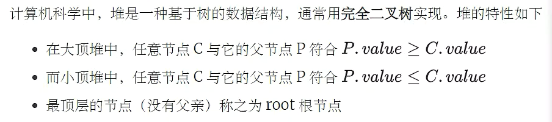

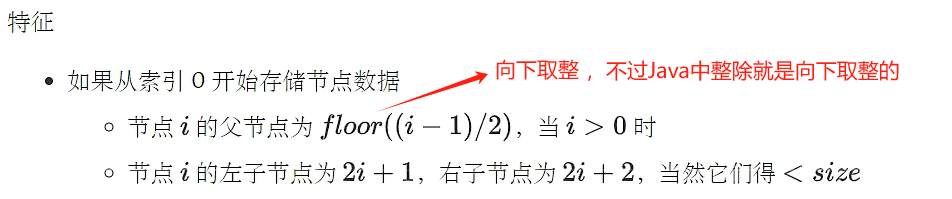

## 优先级队列实现堆

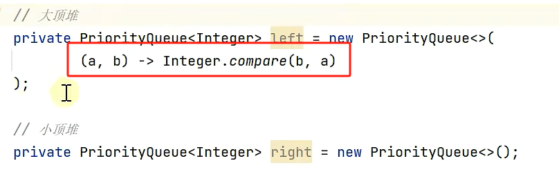

## 大顶堆

```java
public class MaxHeap {
    int[] array;
    int size;

    public MaxHeap(int capacity) {
        this.array = new int[capacity];
    }

    public MaxHeap(int[] array) {
        this.array = array;
        this.size = array.length;
        heapify();
        
    }

    /**
     * 获取堆顶元素，不移除
     * @return 堆顶元素
     */
    public int peek() {
        return array[0];
    }

    /**
     * 获取堆顶元素，并移除
     * 思路：除返回0索引元素之外，先首尾元素交换（数组删除尾元素效率高），再将堆顶元素下潜
     * @return 堆顶元素
     */
    public int poll() {
        int top = array[0];
        swap(0, size - 1);
        size--;
        down(0);
        return top;
    }

    /**
     * 删除指定索引元素
     * 思路和删除堆顶元素一致
     * @param index
     * @return 被删除的元素
     */
    public int poll(int index) {
        int deleted = array[index];
        swap(index, size - 1);
        size--;
        down(index);
        return deleted;
    }

    /**
     * 替换堆顶元素
     */
    public void replace(int element) {
        array[0] = element;
        down(0);
    }

    /**
     * 在堆的尾部添加元素
     * @param element
     * @return 是否添加成功
     */
    public boolean offer(int element) {
        if (size == array.length) {
            return false;
        }
        up(element);
        size++;
        return true;
    }

    private void up(int element) {
        int child = size;//child指向被添加元素
        while (child > 0) {
            int parent = (child - 1) / 2;
            if (element > array[parent]) {
                array[child] = array[parent];
            } else {
                break;
            }
            child = parent;
        }
        array[child] = element;
    }

    /**
     * 建堆算法
     * 1.找到最后一个非叶子节点（size / 2 - 1）
     * 2.从后向前，对每个节点执行下潜操作
     */
    private void heapify() {
        for (int i = size / 2 - 1; i >= 0; i--) {
            down(i);
        }
    }

    private void down(int parent) {
        int left = parent * 2 + 1;
        int right = left + 1;
        int max = parent;
        if (left < size && array[left] > array[max]) {
            max = left;
        }
        if (right < size && array[right] > array[max]) {
            max = right;
        }
        if (max != parent) {
            swap(max, parent);
            down(max);
        }
    }

    private void swap(int i, int j) {
        int temp = array[i];
        array[i] = array[j];
        array[j] = temp;
    }
}
```

## 小顶堆

相较大顶堆，其余代码均一样，需要改变的是：

1.构造方法的名字

2.up方法的 if (element < array[parent]) 改成小于号

3.down 方法的两个if语句都改成小于号，顺便将max改为min

​		if (left < size && array[left] < array[min]) {
​            min = left;
​        }
​        if (right < size && array[right] < array[min) {
​            min = right;
​        }

```java
public class MinHeap {

    public MinHeap(int capacity) {
        this.array = new int[capacity];
    }

    public MinHeap(int[] array) {
        this.array = array;
        this.size = array.length;
        heapify(); 
    }

    private void up(int element) {
        int child = size;
        while (child > 0) {
            int parent = (child - 1) / 2;
            if (element < array[parent]) {
                array[child] = array[parent];
            } else {
                break;
            }
            child = parent;
        }
        array[child] = element;
    }
    private void down(int parent) {
        int left = parent * 2 + 1;
        int right = left + 1;
        int min = parent;
        if (left < size && array[left] < array[min]) {
            min = left;
        }
        if (right < size && array[right] < array[min) {
            min = right;
        }
        if (min != parent) {
            swap(min, parent);
            down(min);
        }
    }
}
```

## 大小堆合并写法

1.加一个布尔类型成员变量，改造构造方法

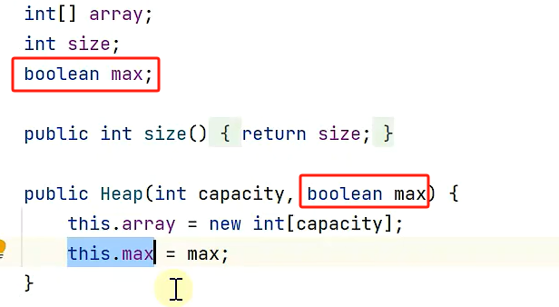


2.改造up方法

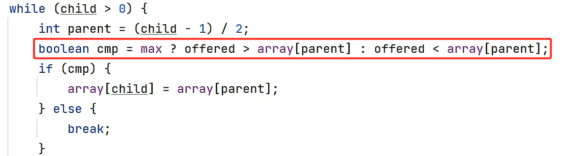

3.改造down方法

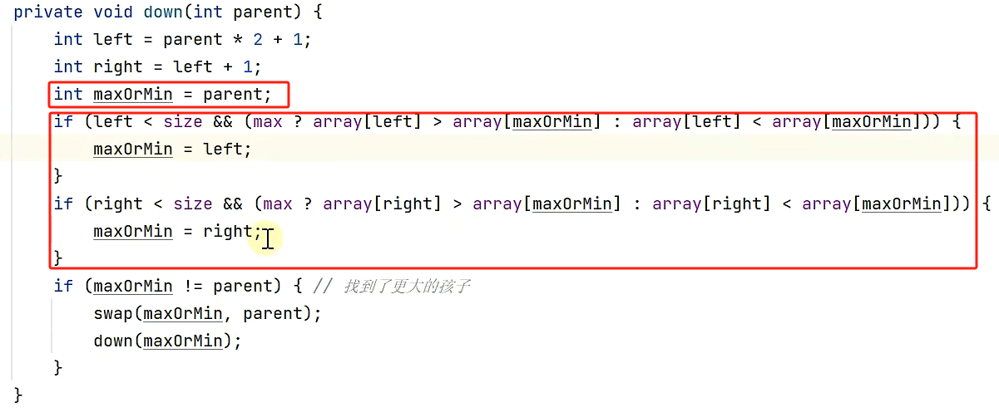

## 堆的扩容

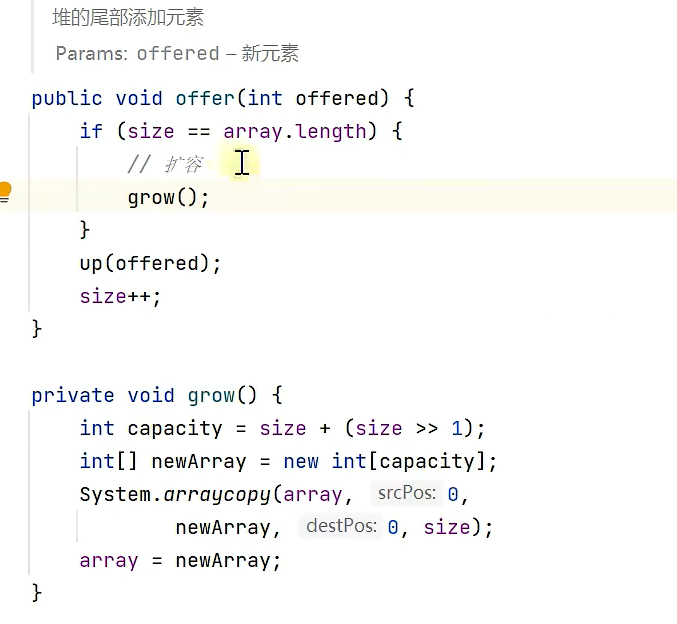


## lc.215 数组中的第K个最大元素 🚩

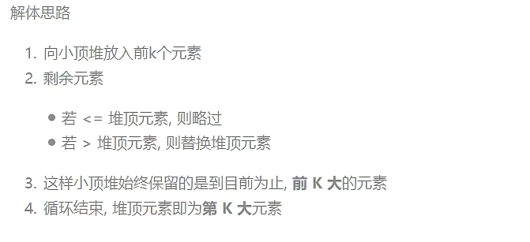

```java
class Solution {
    public int findKthLargest(int[] nums, int k) {
        Minheap minheap = new Minheap(k);
        for (int i = 0; i < k; i++) {
            minheap.offer(nums[i]);
        }
        for (int i = k; i < nums.length; i++) {
            if (nums[i] > minheap.peek()) {
                minheap.replace(nums[i]);
            }
        }
        return minheap.peek();
    }
```

## lc.295 数据流的中位数🚩

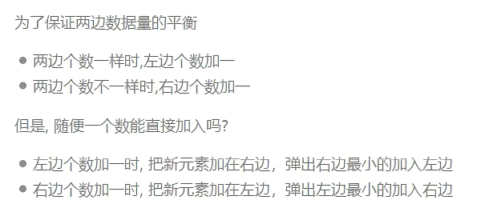

```java
//自定义堆
class MedianFinder {
    private Heap left = new Heap(25000,true);
    private Heap right = new Heap(25000,false);

    public MedianFinder() {}
    
    public void addNum(int num) {
        if(left.getsize() == right.getsize()){
            right.offer(num);
            left.offer(right.poll());
        }else{
            left.offer(num);
            right.offer(left.poll());
        }

    }
    
    public double findMedian() {
        if(left.getsize() == right.getsize()){
            return (left.peek()+right.peek()) / 2.0;
        }else{
            return left.peek();
        }

    }

}
public class Heap{
    int[] array;
    int size;
    boolean max;
    public int getsize(){
        return this.size;
    }
    public Heap(int capacity,boolean max) {
        this.array = new int[capacity];
        this.max = max;
    }
    public int peek() {
        return array[0];
    }
    public int poll() {
        int top = array[0];
        swap(0, size - 1);
        size--;
        down(0);
        return top;
    }
    public void replace(int element) {
        array[0] = element;
        down(0);
    }
    public boolean offer(int element) {
        if (size == array.length) {
            return false;
        }
        up(element);
        size++;
        return true;
    }
    private void up(int element) {
        int child = size;
        while (child > 0) {
            int parent = (child - 1) / 2;
            boolean cmp = max ? element > array[parent] : element < array[parent];
            if (cmp) {
                array[child] = array[parent];
            } else {
                break;
            }
            child = parent;
        }
        array[child] = element;
    }
    private void down(int parent) {
        int left = parent * 2 + 1;
        int right = left + 1;
        int minormax = parent;
        if (left < size && (max ? array[left] > array[minormax] : array[left] < array[minormax])) {
            minormax = left;
        }
        if (right < size && (max? array[right] > array[minormax] : array[right] < array[minormax])) {
            minormax = right;
        }
        if (minormax != parent) {
            swap(minormax, parent);
            down(minormax);
        }
    }
    private void swap(int i, int j) {
        int temp = array[i];
        array[i] = array[j];
        array[j] = temp;
    }
     
}
```

```java
//优先级队列实现堆
class MedianFinder {
    private PriorityQueue<Integer> left = new PriorityQueue<>(
        (a,b)-> Integer.compare(b,a)
    );
    private PriorityQueue<Integer> right = new PriorityQueue<>();

    public MedianFinder() {}
    
    public void addNum(int num) {
        if(left.size() == right.size()){
            right.offer(num);
            left.offer(right.poll());
        }else{
            left.offer(num);
            right.offer(left.poll());
        }

    }
    
    public double findMedian() {
        if(left.size() == right.size()){
            return (left.peek()+right.peek()) / 2.0;
        }else{
            return left.peek();
        }
    }
}
```

# 树

基本术语：

* 度：树中一个节点的孩子个数称为该节点的**度**，树中节点的最大度数称为树的**度**
* 度大于0的结点称为**分支结点**，度为0的结点称为**叶子结点**
* 结点的**深度**是从根结点开始自顶向下逐层累加的。**结点的高度**是从叶结点开始自底向上逐层累加的，**树的高度**是树中结点的最大层数


性质：

* 树中的结点数等于所有结点的度数之和加1
* 度为m的树中第i层上至多有个结点（i 从1 开始)
* 高度为h的m叉树至多有个结点
* 具有n个结点的m叉树的最小高度为


# 二叉树

## 不同种类二叉树

* **二叉树**：
  * 每个结点至多只有两棵子树的树

* **满二叉树**：
  * 如果一棵二叉树只有度为0的结点和度为2的结点，并且度为0的结点在同一层上，则这棵二叉树为满二叉树。

* **完全二叉树**：
  * 高度为h，有n个结点的二叉树，当且仅当其每个结点都与高度为h的满二叉树中编号为1~n的结点一一对应，称为完全二叉树。

* **二叉排序（搜索）树**：
  * 左子树上的所有结点的关键字均小于根结点的关键字，右子树上的所有结点的关键字均大于根结点的关键字。
* **平衡二叉搜索树(AVL树)**：
  * 它是一棵空树或它的左右两个子树的高度差的绝对值不超过1，并且左右两个子树都是一棵平衡二叉树

## 树节点实现（TreeNode）

```java
public class TreeNode {
    public int val;
    public TreeNode left;
    public TreeNode right;

    public TreeNode(int val) {
        this.val = val;
    }

    public TreeNode(TreeNode left, int val, TreeNode right) {
        this.left = left;
        this.val = val;
        this.right = right;
    }

    @Override
    public String toString() {
        return String.valueOf(this.val);
    }
}
```


## 102. 二叉树层序遍历

```java
public class TreeTraversal {
    public static List<List<Integer>> res = new ArrayList<List<Integer>>();

    public static void main(String[] args) {
        /*
                1
               / \
              2   3
             /   / \
            4   5   6
         */
        TreeNode root = new TreeNode(
                new TreeNode(new TreeNode(4), 2, null),
                1,
                new TreeNode(new TreeNode(5), 3, new TreeNode(6))
        );
        cengXu(root);
        System.out.println(res);

    }

    private static void cengXu(TreeNode node) {
        if (node == null) return;
        Queue<TreeNode> queue = new LinkedList<>();
        queue.offer(node);          //先把根节点放进队列

        while (!queue.isEmpty()) {
            List<Integer> list = new ArrayList<>();
            int len = queue.size(); //每一层为一轮，记录每轮节点个数

            while (len > 0) {     //退出该循环表示一层结束开始下一轮，结束一轮的标志
                TreeNode tmpNode = queue.poll();
                list.add(tmpNode.val);

                if (tmpNode.left != null) queue.offer(tmpNode.left);
                if (tmpNode.right != null) queue.offer(tmpNode.right);
                len--;
            }
            res.add(list);//一个小while结束代表一层遍历完，赶紧装到最后的结果集合
        }
    }
}
```


## 104 . 二叉树的最大深度

深度：任意节点到根节点的距离 （前序）

高度：任意节点到叶子节点的距离（后序）

```java
class Solution {
    public int maxDepth(TreeNode root) {
        if(root == null){
            return 0;
        }
        int leftDepth = maxDepth(root.left);
        int rightDepth = maxDepth(root.right);             
        return Integer.max(leftDepth, rightDepth) + 1;
    }
}  
```


## 111 . 二叉树的最小深度

**最小深度是从根节点到最近叶子节点的最短路径上的节点数量**

理解为：前提得是叶子节点，再考虑叶子节点与根节点的最短距离

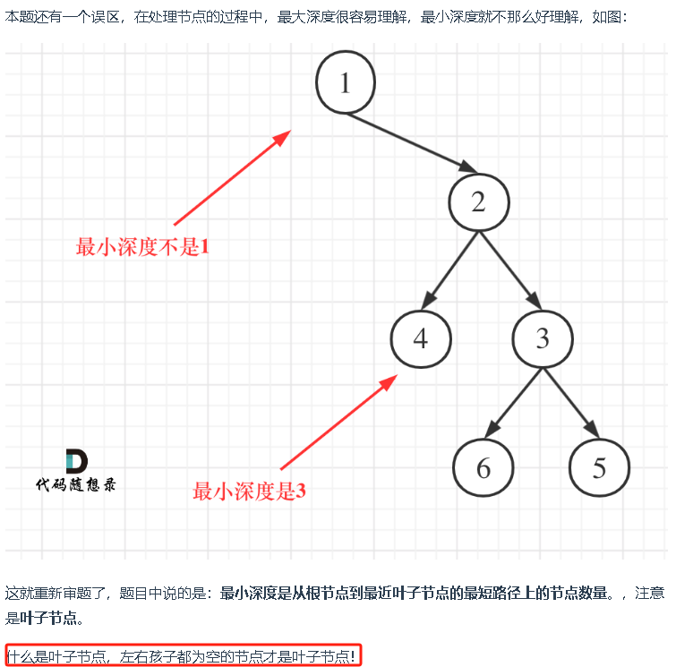

**求二叉树的最小深度和求二叉树的最大深度的差别主要在于处理左右孩子不为空的逻辑。**

```java
class Solution {
    public int minDepth(TreeNode root) {
        if (root == null) {
            return 0;
        }
        int leftDepth = minDepth(root.left);
        int rightDepth = minDepth(root.right);
        if (root.left == null) {
            return rightDepth + 1;
        }
        if (root.right == null) {
            return leftDepth + 1;
        }
        // 左右结点都不为null
        return Math.min(leftDepth, rightDepth) + 1;
    }
}
```


## 222 . 完全二叉树的节点个数

解法1： 按照普通二叉树的逻辑，代码类似求最大深度，即将求左右子树深度改为左右子树的节点个数

```java
class Solution {
    public int countNodes(TreeNode root) {
        if(root == null){
            return 0;
        }
        int leftNum = countNodes(root.left);
        int rightNum = countNodes(root.right);
        return leftNum + rightNum + 1;
    }
}
```

- 时间复杂度：O(n)
- 空间复杂度：O(log n)，算上了递归系统栈占用的空间

解法二： 利用完全二叉树特性


## 110 . 平衡二叉树

平衡二叉树定义为： **每个节点** 的左右两个子树的**高度差**的绝对值不超过1

求**高度**固定用**后序遍历**： 奠定此题基础，先遍历左、再右、最后做当前根节点的处理

```java
class Solution {
  
    public boolean isBalanced(TreeNode root) {
        //想好启动递归的传入参数，是根节点还是两个子树
        //本题是一个根节点
        return getHeight(root) != -1;
    }
    
	//返回值是以该节点为根节点树的高度，返回-1代表两个子树高度差大于1，表示已经不是平衡二叉树了
    private int getHeight(TreeNode root) {
        
        //空节点高度为0
        //6.后续遍历开始时会直通最底层，所以得先定义好空节点的高度
        if (root == null) {
            return 0;
        }
        //1.获得左子树的高度
        int leftHeight = getHeight(root.left);
        //5.发现-1提前结束
        if (leftHeight == -1) {
            return -1;
        }
        
        //2.获取右子树的高度
        int rightHeight = getHeight(root.right);
        ////5.发现-1提前结束
        if (rightHeight == -1) {
            return -1;
        }
        
        //4.意外情况判断：左右子树差值大于1，则表示整个树已经不是平衡二叉树了，用-1表示
        if (Math.abs(leftHeight - rightHeight) > 1) {
            return -1;
        }
        //3.返回以该节点为根节点树的高度
        //这里为什么要返回以该节点的最大深度？
        //以根节点为例，假设其左子树为空，右子树内部遍历后未发现插值大于1，则getHeight的返回值要代表右子树的高度与左子树做差值比较，而只有最大深度才能代表（假如是min（），则会出问题）
        return Math.max(leftHeight, rightHeight) + 1;
    }
}

```


## 404 . 左叶子之和

```
4
114514/1919810 1454/91980
114514/1919810 454/9980
114514/1919810 114514/1919810
21/42 1/2
```


```java
class Solution {
    public int sumOfLeftLeaves(TreeNode root) {
        if (root == null){
            return 0;
        }
        int leftnum = sumOfLeftLeaves(root.left);
        int rightnum = sumOfLeftLeaves(root.right);
        int sum = 0;
        if(root.left != null && root.left.left == null && root.left.right == null){
            //判断当前节点的左叶子节点：当前节点的左孩子不为空，且左孩子的左右孩子为空
            sum = root.left.val;
        }
        return sum + leftnum + rightnum;
    }
}
```

## 105. 中序与前序遍历构造二叉树


## 106. 中序与后序遍历构造二叉树


# 排序算法

## 冒泡排序

```
要比较几轮：arr.length - 1 轮
每轮比较次数：从arr.length - 1 次开始逐轮减一
用指针X记录X右边已经排好序了，次数由逐轮减一变成直接到指针X处的次数，优化代码
```

```java
private static void bubble(int[] a) {
    int j = a.length - 1;
    while (true) {
        int x = 0;
        for (int i = 0; i < j; i++) {
            if (a[i] > a[i + 1]) {
                int t = a[i];
                a[i] = a[i + 1];
                a[i + 1] = t;
                x = i;
            }
        }
        j = x;
        if (j == 0) {
            break;
        }
    }
}
```


## 选择排序

思路：

```
先假设一个最大值（比如最后一个元素），再找真正的最大值，做交换，再假设倒数第二个元素最大，以此类推
```

代码：

```java
public class SelectionSort {
    public static void sort(int[] a) {
        
        for (int right = a.length - 1; right > 0 ; right--) {
            //先假设最右边元素为最大值，max指针指着它
            int max = right;
            //依次比较，max始终指向最大值
            for (int i = 0; i < right; i++) {
                if (a[i] > a[max]) {
                    max = i;
                }
            }
            //最后一个元素不是最大的，给最大值易位
            if(max != right) {
                swap(a, max, right);
            }
        }
    }

    private static void swap(int[] a, int i, int j) {
        int t = a[i];
        a[i] = a[j];
        a[j] = t;
    }

}
```

最好、最坏、平均 时间复杂度：O(n^2)

空间复杂度：O(1)

## 插入排序

思路：

* 将数组分为两部分 [0 .. low-1]  [low .. a.length-1]
  * 左边 [0 .. low-1] 是已排序部分
  * 右边 [low .. a.length-1] 是未排序部分
* 每次从未排序区域取出 *low* *位置的元素*, 插入到已排序区域

```Java
public class InsertionSort {

    public static void sort(int[] a) {
        for (int low = 1; low < a.length; low++) {
            // 将 low 位置的元素插入至 [0..low-1] 的已排序区域
            int t = a[low];
            int i = low - 1; // 已排序区域指针

            while (i >= 0 && t < a[i]) { // 没有找到插入位置
                a[i + 1] = a[i]; // 空出插入位置
                i--;
            }

            // 找到插入位置
            if (i != low - 1) {
                a[i + 1] = t;
            }
        }
    }
```

最好 时间复杂度：O(n)

最坏、平均 时间复杂度：O(n^2)

空间复杂度：O(1)

## 堆排

思路：建立大顶堆，将堆顶与堆底交换，缩小并下潜调整堆，重复执行直到堆里只剩一个元素

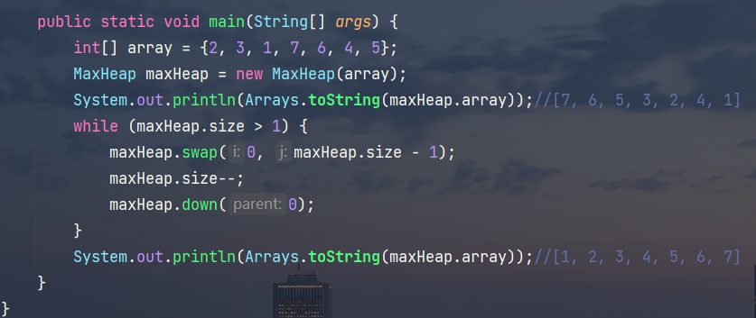


## 单边快排

单边循环要点：

* 选择最右侧元素作为基准点
* j 找比基准点小的，i 找比基准点大的，一旦找到，二者进行交换
  * 交换时机：j 找到小的，且与 i 不相等
  * i 找到 >= 基准点元素后，不应自增
* 最后基准点与 i 交换，i 即为基准点最终索引

```
最右侧元素做基准点，i，j都从最做的left开始，只不过j相当于是快指针，只找比基准点小的，i是慢指针，找到大的就停下来，等着j找小的与其交换
注意：
递归结束条件为left >= right
递归方法只干3件事：
1.退出条件的判断
2.从partition方法接收基准点索引
3.以基准点为中心，分别在左右两个区进行递归
```


```java
public static void main(String[] args) {
        int[] a = {3, 6, 5, 7, 9, 2, 8, 1, 4};
        System.out.println(Arrays.toString(a));
        quick(a, 0, a.length - 1);          //启动的地方
        System.out.println(Arrays.toString(a));
    }

private static void quick(int[] a, int left, int right) {
        if (left >= right) return; // >=
        int p = partition(a, left, right);//基准点元素索引
        quick(a, left, p - 1);
        quick(a, p + 1, right);
    }
private static int partition(int[] a, int left, int right) {
        int pv = a[right];//分区开始时默认最右侧为 基准点
        int i = left;
        int j = left;
        while (j < right) {
            if (a[j] < pv) {//j找到比基准值小的，即没找到大的,如果找到大的不进入这个if语句,相当于把i丢在比基准点大的这不动了，等着j去找小的
                if (i != j) swap(a, i, j);
                i++;
            }
            j++;
        }
        swap(a, i, right);//分区结束时交换，基准点为i指向的元素
        return i;
    }
private static void swap(int[] a, int i, int j) {
        int t = a[i];
        a[i] = a[j];
        a[j] = t;
    }
```

## 双边快排

相较单边快排，只需改动partition( )方法即可

```java
private static int partition(int[] a, int left, int right) {
    int pv = a[left];
    int i = left;
    int j = right;
    while (i < j) {
        while (i < j && a[j] > pv) {
            j--;
        }
        while (i < j && a[i] <= pv) {
            i++;
        }
        swap(a, i, j);
    }
    swap(a, left, j);
    return j;
 }
```


# 回溯算法

回溯本质是穷举，穷举出所有可能，然后选出想要的答案

组合无序，排列有序

## 77. 组合

给定两个整数 n 和 k，返回 1 ... n 中所有可能的 k 个数的组合。

示例: 输入: n = 4, k = 2 输出: [ [2,4], [3,4], [2,3], [1,2], [1,3], [1,4], ]

```Java
class Solution {
    
    List<List<Integer>> result = new ArrayList<>();
    LinkedList<Integer> path = new LinkedList<>();

    public List<List<Integer>> combine(int n, int k) {
        backtracking(n,k,1);
        return result;
    }
    public void backtracking(int n, int k, int startIndex){
        if(path.size() == k){
            //result.add(path);   为什么add(path)不行？
            result.add(new ArrayList<>(path));
            return;
        }
        for(int i = startIndex; i <= n;i++){
            path.add(i);
            backtracking(n,k,i+1);
            path.removeLast();
        }
    }
}
```

## 216. 组合总和Ⅲ

找出所有相加之和为 n 的 k 个数的组合。组合中只允许含有 1 - 9 的正整数，并且每种组合中不存在重复的数字。

说明：

- 所有数字都是正整数。
- 解集不能包含重复的组合。

示例 1: 输入: k = 3, n = 7 输出: [[1,2,4]]

示例 2: 输入: k = 3, n = 9 输出: [[1,2,6], [1,3,5], [2,3,4]]

```Java
class Solution {
    List<List<Integer>> result = new ArrayList<>();
    LinkedList<Integer> path = new LinkedList<>();
    public List<List<Integer>> combinationSum3(int k, int n) {
        backtracking(n,k,1,0);
        return result;
    }
    public void backtracking(int n, int k, int startIndex,int sum){
        if(path.size() == k){
            if(sum == n){
                result.add(new ArrayList<>(path));
            }  
            return;  
        }    
        for(int i = startIndex; i <= 9;i++){
            sum += i;
            path.add(i);
            backtracking(n,k,i+1,sum);
            path.removeLast();
            sum -= i;
        }
    }
}
```

## 39. 组合总和

```java
class Solution {
    List<List<Integer>> result = new ArrayList<>();
    LinkedList<Integer> path = new LinkedList<>();
    public List<List<Integer>> combinationSum(int[] candidates, int target) {
        backtracking(candidates,target,0,0);
        return result;
    }
    public void backtracking(int[] candidates, int target, int startIndex,int sum){
        if(sum > target){
            return;
        }
        if(sum == target){
            result.add(new ArrayList<>(path));
            return;
        }
       
        for(int i = startIndex; i < candidates.length;i++){
            sum += candidates[i];
            path.add(candidates[i]);
            backtracking(candidates,target,i,sum);
            path.removeLast();
            sum -= candidates[i];
        }
    }
}
```

## 40. 组合总和Ⅱ

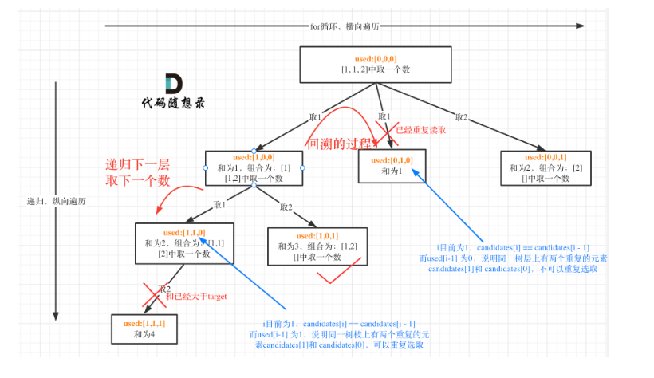

```Java
class Solution {
    List<List<Integer>> result = new ArrayList<>();
    LinkedList<Integer> path = new LinkedList<>();
    boolean[] used;//声明为全局变量，每次传递都NEW的话数据都丢失了
    public List<List<Integer>> combinationSum2(int[] candidates, int target) {
        Arrays.sort(candidates);//必须先排序，将相同的元素挨在一起
        used = new boolean[candidates.length];
        backtracking(candidates,target,0,0,used);
        return result;
    }
    public void backtracking(int[] candidates, int target, int startIndex,int sum,boolean[] used){
        if(sum > target){
            return;
        }
        if(sum == target){
            result.add(new ArrayList<>(path));
            return;
        }
       
        for(int i = startIndex; i < candidates.length;i++){
            //前后相同时，前面的取过了后面才能取
            if(i>0 && candidates[i] == candidates [i-1] && used[i-1] == false){
                continue;
            }
            sum += candidates[i];
            path.add(candidates[i]);
            used[i] = true;
            backtracking(candidates,target,i+1,sum,used);
            path.removeLast();
            sum -= candidates[i];
            used[i] = false;
        }
    }
}
```

## 78. 子集

给定一组不含重复元素的整数数组 nums，返回该数组所有可能的子集（幂集）。

说明：解集不能包含重复的子集。

示例: 输入: nums = [1,2,3] 输出: [ [3],  [1],  [2],  [1,2,3],  [1,3],  [2,3],  [1,2],  [] ]

如果把 子集问题、组合问题、分割问题都抽象为一棵树的话，**那么组合问题和分割问题都是收集树的叶子节点，而子集问题是找树的所有节点！**

**求取子集问题，不需要任何剪枝！因为子集就是要遍历整棵树**

```java
class Solution {
    List<List<Integer>> result = new ArrayList<>();
    LinkedList<Integer> path = new LinkedList<>();
    public List<List<Integer>> subsets(int[] nums) {
        backtracking(nums,0);
        return result;
    }
    public void backtracking(int[] nums,int startIndex){
        result.add(new ArrayList<>(path));
        if(startIndex >= nums.length){
            return;
        }
        for(int i = startIndex; i < nums.length;i++){
            
            path.add(nums[i]);
            backtracking(nums,i+1);
            path.removeLast();           
        }
    }
}
```

## 90. 子集Ⅱ

给定一个可能包含重复元素的整数数组 nums，返回该数组所有可能的子集（幂集）

```java
class Solution {
    List<List<Integer>> result = new ArrayList<>();
    LinkedList<Integer> path = new LinkedList<>();
    boolean[] used;
    public List<List<Integer>> subsetsWithDup(int[] nums) {
        Arrays.sort(nums);
        used = new boolean[nums.length];
        backtracking(nums,used,0);
        return result;
    }
    public void backtracking(int[] nums,boolean[] used,int startIndex){
        result.add(new ArrayList<>(path));
        if(startIndex >= nums.length){  
            return;
        }
        for(int i = startIndex; i < nums.length;i++){
            if(i>0 && nums[i]==nums[i-1] && used[i-1]==false){
                continue;
            }
            path.add(nums[i]);
            used[i] = true;
            backtracking(nums,used,i+1);
            path.removeLast();
            used[i] = false;          
        }
    }
}
```


## 46. 全排列

给定一个 没有重复 数字的序列，返回其所有可能的全排列。

示例:

- 输入: [1,2,3]
- 输出: [ [1,2,3], [1,3,2], [2,1,3], [2,3,1], [3,1,2], [3,2,1] ]

```java
该题的used是用来在每层遍历时，排除当前索引i的，作用如同组合问题的startIndex
class Solution {
    List<List<Integer>> result = new ArrayList<>();
    LinkedList<Integer> path = new LinkedList<>();
    boolean[] used;
    public List<List<Integer>> permute(int[] nums) {
        used = new boolean[nums.length];
        backtracking(nums,used);
        return result;
    }
    public void backtracking(int[] nums,boolean[] used){
        if(path.size() == nums.length){
            result.add(new ArrayList<>(path));
            return;
        }
        for(int i = 0; i < nums.length;i++){
            if(used[i] == true){
                continue;
            }
            path.add(nums[i]);
            used[i] = true;
            backtracking(nums,used);
            path.removeLast();
            used[i] = false;          
        }
    }
}
```


## 47. 全排列Ⅱ

给定一个可**包含重复数字**的序列 nums ，按任意顺序 返回所有不重复的全排列

**去重一定要对元素进行排序，这样我们才方便通过相邻的节点来判断是否重复使用了**

**组合问题和排列问题是在树形结构的叶子节点上收集结果，而子集问题就是取树上所有节点的结果**。

```java
class Solution {
    List<List<Integer>> result = new ArrayList<>();
    LinkedList<Integer> path = new LinkedList<>();
    boolean[] used;
    public List<List<Integer>> permuteUnique(int[] nums) {
        Arrays.sort(nums);
        used = new boolean[nums.length];
        backtracking(nums,used);
        return result;
    }
    public void backtracking(int[] nums,boolean[] used){
        if(path.size() == nums.length){
            result.add(new ArrayList<>(path));
            return;
        }
        for(int i = 0; i < nums.length;i++){
            if(used[i] == true){
                continue;
            }
            if(i>0 && nums[i]==nums[i-1] && used[i-1]==false){
                continue;
            }
            path.add(nums[i]);
            used[i] = true;
            backtracking(nums,used);
            path.removeLast();
            used[i] = false;          
        }
    }
}
```

# 贪心算法

## lc.455 分发饼干

**思路：一定要 for 控制 胃口，里面的 if 控制饼干**

```
class Solution {
    public int findContentChildren(int[] g, int[] s) {
        Arrays.sort(g);
        Arrays.sort(s);
        int count = 0;
        int index = s.length - 1;
        for (int i = g.length - 1; i >= 0; i--) {
            if (index >= 0 && s[index] >= g[i]) {
                index--;
                count++;
            }
        }
        return count;
    }
}
```


## lc.376 摆动序列

**实际操作上，其实连删除的操作都不用做，因为题目要求的是最长摆动子序列的长度，所以只需要统计数组的峰值数量就可以了（相当于是删除单一坡度上的节点，然后统计长度）**

**这就是贪心所贪的地方，让峰值尽可能的保持峰值，然后删除单一坡度上的节点**

**但本题要考虑三种情况：**

1. **情况一：上下坡中有平坡**
2. **情况二：数组首尾两端**
3. **情况三：单调坡中有平坡**

```
class Solution {
    public int wiggleMaxLength(int[] nums) {
        if (nums.length <= 1) {
            return nums.length;
        }
        int pre = 0;
        int cur = 0;
        int count = 1;
        for (int i = 0; i < nums.length - 1; i++) {
            cur = nums[i + 1] - nums[i];
            if ((pre <= 0 && cur > 0) || (pre >= 0 && cur < 0)) {
                count++;
                pre = cur;
            }
        }
        return count;
    }
}
```

## lc.53 最大子数组和

该题未能过lc，但思想可学习

```
class Solution {
    public int maxSubArray(int[] nums) {
        int res = Integer.MIN_VALUE;
        int sum = 0;
        for(int i = 0;i<nums.length;i++){
            sum += nums[i];
            res = Math.max(sum,res);
            if(res <= 0){
                sum = 0;
            }
        }
        return res;
    }
}
```


# 动态规划

**动规是由前一个状态推导出来的，而贪心是局部直接选最优的**

**对于动态规划问题，我将拆解为如下五步曲，这五步都搞清楚了，才能说把动态规划真的掌握了！**

1. 确定dp数组以及下标的含义
2. 确定递推公式
3. dp数组如何初始化
4. 确定遍历顺序
5. 举例推导dp数组

## lc.509 斐波那契数

1. 确定dp数组以及下标的含义

​		dp[i]的定义为：第 i个数的斐波那契数值是dp[i]

2. 确定递推公式

   **dp[i] = dp[i - 1] + dp[i - 2]**

3. dp数组如何初始化

   dp[0] = 0;  dp[1] = 1;

4. 确定遍历顺序

   从递归公式dp[i] = dp[i - 1] + dp[i - 2];中可以看出，dp[i]是依赖 dp[i - 1] 和 dp[i - 2]，那么遍历的顺序一定是从前到后遍历的

5. 举例推导dp数组

   N为10的时候，dp数组应该是如下的数列：

   0 1 1 2 3 5 8 13 21 34 55

```java
class Solution {
    public int fib(int n) {
        if(n<=1) return n;
        int[] dp = new int[n+1];
        dp[0] = 0;
        dp[1] = 1;
        for(int i = 2;i < dp.length;i++){
            dp[i] = dp[i-1] + dp[i-2];
        }
        return dp[n];
    }
}
```

- 时间复杂度：O(n)
- 空间复杂度：O(n)

降维：

```java
class Solution {
    public int fib(int n) {
        if(n<=1) return n;
        int[] dp = new int[2];
        dp[0] = 0;
        dp[1] = 1;
        for(int i = 2;i <= n;i++){
            int sum = dp[0] + dp[1];
            dp[0] = dp[1];
            dp[1] = sum;
        }
        return dp[1];
    }
}
```

- 时间复杂度：O(n)
- 空间复杂度：O(1)

## lc.70 爬楼梯🚩

1. 确定dp数组以及下标的含义

   dp[i]： 爬到第i层楼梯，有dp[i]种方法

2. 确定递推公式

   首先是dp[i - 1]，上i-1层楼梯，有dp[i - 1]种方法，那么再一步跳一个台阶不就是dp[i]了么。

   还有就是dp[i - 2]，上i-2层楼梯，有dp[i - 2]种方法，那么再一步跳两个台阶不就是dp[i]了么。

   那么dp[i]就是 dp[i - 1]与dp[i - 2]之和！

3. dp数组如何初始化

   不考虑dp[0]如何初始化，只初始化dp[1] = 1，dp[2] = 2，然后从i = 3开始递推，这样才符合dp[i]的定义。

4. 确定遍历顺序

   从递推公式dp[i] = dp[i - 1] + dp[i - 2];中可以看出，遍历顺序一定是从前向后遍历的

5. 举例推导dp数组

   举例当n为5的时候，dp table（dp数组）应该是这样的

   从下标1开始：1，2，3，5，8

```java
class Solution {
    public int climbStairs(int n) {
        if (n <= 2) return n;
        int[] dp = new int[n + 1];
        dp[1] = 1;
        dp[2] = 2;
        for (int i = 3; i <= n; i++) {
            dp[i] = dp[i - 1] + dp[i - 2];
        }
        return dp[n];
    }
}
```

降维：

```java
class Solution {
    public int climbStairs(int n) {
        if (n <= 2) return n;
        int[] dp = new int[2];
        dp[0] = 1;
        dp[1] = 2;
        for (int i = 3; i <= n; i++) {
            int t = dp[0] + dp[1];
            dp[0] = dp[1]; 
            dp[1] = t;
        }
        return dp[1];
    }
}
```

## lc.746 使用最小花费爬楼梯

1. 确定dp数组以及下标的含义

   dp[i]: 到达第i个台阶的最少花费dp[i]

2. 确定递推公式

   **可以有两个途径得到dp[i]，一个是dp[i-1] 一个是dp[i-2]**。

   dp[i - 1] 跳到 dp[i] 需要花费 dp[i - 1] + cost[i - 1]。

   dp[i - 2] 跳到 dp[i] 需要花费 dp[i - 2] + cost[i - 2]。

   那么究竟是选从dp[i - 1]跳还是从dp[i - 2]跳呢？

   一定是选最小的，所以dp[i] = min(dp[i - 1] + cost[i - 1], dp[i - 2] + cost[i - 2]);

3. dp数组如何初始化

   dp[0] = 0，dp[1] = 0

4. 确定遍历顺序

   因为是模拟台阶，而且dp[i]由dp[i-1]dp[i-2]推出，所以是从前到后遍历cost数组就可以了

5. 举例推导dp数组

   略

 

```java
class Solution {
    public int minCostClimbingStairs(int[] cost) {
        int[] dp = new int[cost.length + 1];
        dp[0] = 0;
        dp[1] = 0;
        for (int i = 2; i <= cost.length; i++) {
            dp[i] = Math.min(dp[i - 1] + cost[i - 1], dp[i - 2] + cost[i - 2]);
        }
        return dp[cost.length];
    }
}
```

- 时间复杂度：O(n)
- 空间复杂度：O(n)

## lc.62 不同路径🚩

1. 确定dp数组以及下标的含义

   

2. 确定递推公式

   

3. dp数组如何初始化

   

4. 确定遍历顺序

   

5. 举例推导dp数组

```java
class Solution {
    public int uniquePaths(int m, int n) {
        int[][] dp = new int[m][n];
        for (int i = 0; i < n; i++) {
            dp[0][i] = 1;
        }
        for (int i = 0; i < m; i++) {
            dp[i][0] = 1;
        }
        for (int i = 1; i < m; i++) {
            for (int j = 1; j < n; j++) {
                dp[i][j] = dp[i][j - 1] + dp[i - 1][j];
            }
        }
        return dp[m - 1][n - 1];
    }
}
```

- 时间复杂度：O(m × n)
- 空间复杂度：O(m × n)

## lc.63 不同路径Ⅱ

1. 确定dp数组以及下标的含义

   dp[i] [j]: 表示从（0 ，0）出发，到(i, j) 有dp[i][j]条不同的路径

2. 确定递推公式

   dp[i] [j] = dp[i] [j - 1] + dp[i - 1] [j];

   但因为只能向左和向下移动，所以障碍物（i，j）只影响其右边和下边，

   其右边的dp[i] [j+1]只等于来自上面的dp[i-1] [j+1]，其下面的dp[i+1] [j]只等于来自左边的dp[i+1] [j]

   **故设置障碍物所在的位置对应的dp[i] [j] ==0即可**

3. dp数组如何初始化

   dp第0行和第0列均赋值为1

   但是存在障碍物时，其左边和下边均到达不了，故赋值为0

4. 确定遍历顺序

   一定是从左到右一层一层遍历

5. 举例推导dp数组

```java
class Solution {
    public int uniquePathsWithObstacles(int[][] obstacleGrid) {
        int m = obstacleGrid.length;
        int n = obstacleGrid[0].length;
        int[][] dp = new int[m][n];
        for (int i = 0; i < m && obstacleGrid[i][0] == 0; i++) {
            dp[i][0] = 1;
        }
        for (int i = 0; i < n && obstacleGrid[0][i] == 0; i++) {
            dp[0][i] = 1;
        }
        for (int i = 1; i < m; i++) {
            for (int j = 1; j < n; j++) {
                dp[i][j] = obstacleGrid[i][j] == 0 ? dp[i - 1][j] + dp[i][j - 1] : 0;
            }
        }
        return dp[m - 1][n - 1];
    }
}
```

- 时间复杂度：O(m × n)
- 空间复杂度：O(m × n)

## lc.118 杨辉三角🚩

dp：定义状态 dpi][j] 为杨辉三角中第 i 行第 j 列（行列索引从 0 开始）的元素值

状态转移方程为：dp[i] [j] = dp[i - 1] [j - 1] + dp[i - 1] [j]，其中 dp[i - 1] [j - 1] 和 dp[i - 1] [j] 是当前元素左上方和上方的元素值。 需要注意的是，每一行的第一个元素和最后一个元素都是 1，即当 j=0 或 j=i 时，dp[i] [j] = 1

二维数组每行是一个一维数组，只定义了行数后，每行可再自定义长度不一（列长）的数组

```java
class Solution {
    public List<List<Integer>> generate(int numRows) {
        Integer[][] dp = new Integer[numRows][];
        List<List<Integer>> res = new ArrayList<>();
        dp[0] = new Integer[] { 1 };
        for (int i = 1; i < numRows; i++) {
            dp[i] = new Integer[i + 1];
            for (int j = 0; j <= i; j++) {
                dp[i][j] = (j == 0 || i == j) ? 1 : dp[i - 1][j - 1] + dp[i - 1][j];
            }
        }
        for (Integer[] row : dp) {
            res.add(Arrays.asList(row));
        }
        return res;
    }
}
```

## lc.416 分割等和子集

思路：转为01背包问题：问题可等价为能否找出 和 为元素总和一半 的子集，即背包容量为sum/2,物品等价为元素，物品重量等价nums[i],物品价值也等价于nums[i]，01背包是最大价值，同样的，这里也是最大价值，不过也等同最大重量，最大不过背包容量，最后比较背包装的物品最大重量是否与背包容量（sum/2）相等即可

```java
class Solution {
    public boolean canPartition(int[] nums) {
        if (nums == null || nums.length == 0) return false;   
        int sum = 0;
        for (int num : nums) {
            sum += num;
        }
        //两个相等的数之和不可能是奇数
        if ((sum % 2) != 0)
            return false;
        int target = sum / 2;
        int[] dp = new int[target + 1];
        //初始化
        for (int i = nums[0]; i <= target; i++) {
            dp[i] = nums[0];
        }
        //遍历
        for (int i = 1; i < nums.length; i++) {
            //倒序，因为dp是一维，且dp[i]更新只跟左边有关，如果从左到右遍历 左边的元素在改变，所以倒序遍历
            for (int j = target; j > 0; j--) {
                if (j >= nums[i]) {
                    dp[j] = Math.max(dp[j], dp[j - nums[i]] + nums[i]);
                }
            }
            //放在循环里面可提前返回，剪枝
            if (dp[target] == target) return true;
           
        }
        return dp[target] == target;
    }
}
```

```java
本题还可以将初始化和遍历集合在一起
for (int i = 0; i < nums.length; i++){
    for (int j = target; j >= nums[i]; j--){
        dp[j] = Math.max(dp[j], dp[j - nums[i]] + nums[i]);
    }
}
```

## lc.139 单词拆分🚩

```java
public boolean wordBreak(String s, List<String> wordDict) {
    boolean[] mark = new boolean[s.length() + 1];
    mark[0] = true;
    HashSet<String> set = new HashSet<>(wordDict);
    for (int i = 1; i < s.length() + 1; i++) {
        for (int j = 0; j < i; j++) {
            if (set.contains(s.substring(j, i)) && mark[j]) {
                mark[i] = true;
            }
        }
    }
    return mark[s.length()];
}
```

## lc.198 打家劫舍🚩

```java
class Solution {
    public int rob(int[] nums) {
        if (nums == null || nums.length == 0)
            return 0;
        int[][] dp = new int[2][nums.length];
        dp[0][0] = nums[0];
        dp[1][0] = 0;
        for (int j = 1; j < nums.length; j++) {
            dp[0][j] = dp[1][j - 1] + nums[j];
            dp[1][j] = Math.max(dp[0][j - 1], dp[1][j - 1]);
        }
        return Math.max(dp[0][nums.length - 1], dp[1][nums.length - 1]);
    }
}
```

```java
class Solution {
	public int rob(int[] nums) {
		if (nums == null || nums.length == 0) return 0;
		if (nums.length == 1) return nums[0];
		int[] dp = new int[nums.length];
        //注意是怎么初始化的
		dp[0] = nums[0];
		dp[1] = Math.max(dp[0], nums[1]);
        
		for (int i = 2; i < nums.length; i++) {
			dp[i] = Math.max(dp[i - 1], dp[i - 2] + nums[i]);
		}
		return dp[nums.length - 1];
	}
}
```

## lc.213 打家劫舍Ⅱ

```java
class Solution {
    public int rob(int[] nums) {
        if (nums == null || nums.length == 0) return 0;
        if(nums.length == 1) return nums[0];
        if(nums.length == 2) return Math.max(nums[0],nums[1]);
        int dp1[][] = new int[2][nums.length-1];
        dp1[1][1] = nums[0];
        for (int j = 2; j < nums.length-1; j++) {
            dp1[0][j] = dp1[1][j - 1] + nums[j];
            dp1[1][j] = Math.max(dp1[0][j - 1], dp1[1][j - 1]);
        }
       
        int[][] dp2 = new int[2][nums.length];
        dp2[0][1] = nums[1];
        dp2[1][1] = 0;
        for (int j = 2; j < nums.length; j++) {
            dp2[0][j] = dp2[1][j - 1] + nums[j];
            dp2[1][j] = Math.max(dp2[0][j - 1], dp2[1][j - 1]);
        }
        int firstrobed = Math.max(dp1[0][nums.length - 2], dp1[1][nums.length - 2]);
        int firstunrob = Math.max(dp2[0][nums.length - 1], dp2[1][nums.length - 1]);

        return Math.max(firstrobed, firstunrob);
    }
}
```

## lc.300 最长递增子序列🚩

```java
class Solution {
    public int lengthOfLIS(int[] nums) {
        int[] dp = new int[nums.length];
        Arrays.fill(dp, 1);
        int res = 1;
        for (int i = 1; i < nums.length; i++) {
            for (int j = 0; j < i; j++) {
                if (nums[i] > nums[j]) {
                    dp[i] = Math.max(dp[i], dp[j] + 1);
                }
            }
            res = Math.max(res, dp[i]);
        }
        return res;
    }
}
```


# 图论

## lc.797 所有可能的路径（dfs）

```Java
class Solution {

    List<List<Integer>> res = new ArrayList<>();
    List<Integer> curpath = new ArrayList<>();

    public List<List<Integer>> allPathsSourceTarget(int[][] graph) {
        curpath.add(0); //注意：0加在存储当前路径的集合里
        dfs(graph, 0);
        return res;
    }

    private void dfs(int[][] graph, int node) {

        if (node == graph.length - 1) {
            res.add(new ArrayList<>(curpath));//注意：直接加curpath就是加了其引用，res会随curpath											的改变而改变；重新new就是加了其副本，res和curpath相互独立
            return;
        }

        for (int i = 0; i < graph[node].length; i++) {
            int nextNode = graph[node][i];
            curpath.add(nextNode);
            dfs(graph, nextNode);
            curpath.remove(Integer.valueOf(nextNode));//不能直接删基本数据类型元素，需要转成对应包装类
            //或者cnt.remove(curpath.size() - 1);  这里细品，永远删集合最后一个元素
        }
    }
}
```

## lc.200 岛屿数量🚩

`bfs`：

```java
class Solution {
  
    int[][] dir = {{1,0},{0,1},{-1,0},{0,-1}};
    boolean[][] visited;
    
    public int numIslands(char[][] grid) {
        visited = new boolean[grid.length][grid[0].length];
        int res = 0;
        for(int i = 0; i < grid.length; i++) {
            for(int j = 0; j < grid[0].length; j++) {
                if(!visited[i][j] && grid[i][j] == '1') {
                    bfs(grid, i, j);
                    res++;
                }
            }
        }
        return res;
    }
    
    private void bfs(char[][] grid,int x,int y){
        List<int[]> que = new LinkedList<>();
        que.addLast(new int[]{x,y});
        visited[x][y] = true;
        while(!que.isEmpty()){
            int[] cur = que.removeFirst();
            int curx = cur[0];
            int cury = cur[1];
            for(int i = 0; i < 4; i++){
                int nextx = curx + dir[i][0];
                int nexty = cury + dir[i][1];
                if(nextx<0 || nextx == grid.length || nexty<0 || nexty==grid[0].length){
                    continue;
                }
                if(!visited[nextx][nexty] && grid[nextx][nexty] == '1'){
                    que.addLast(new int[]{nextx,nexty});
                    visited[nextx][nexty] = true;
                }
            }
        }
    }
}
```

## lc.695 岛屿的最大面积

`bfs：`相较岛屿数量的代码，本题只需改动几点，记录每次进入bfs搜到的元素为1的个数，再取一个最大的

```Java
class Solution {
    int[][] dir = { { 1, 0 }, { 0, 1 }, { -1, 0 }, { 0, -1 } };
    boolean[][] visited;

    public int maxAreaOfIsland(int[][] grid) {
        visited = new boolean[grid.length][grid[0].length];
        int res = 0; //初始化最大个数，也可定义在全局变量
        for (int i = 0; i < grid.length; i++) {
            for (int j = 0; j < grid[0].length; j++) {
                if (!visited[i][j] && grid[i][j] == 1) {
                    res = Math.max(res, bfs(grid, i, j));//达到条件进入bfs，比较返回的个数每次保存最大的
                }
            }
        }
        return res;
    }
	//将每个bfs找到的岛屿个数作为返回
    private int bfs(int[][] grid, int x, int y) {
        int sum = 1;//能进入bfs即代表至少个数有1个，故初始化为1
        List<int[]> que = new LinkedList<>();
        que.addLast(new int[] { x, y });
        visited[x][y] = true;
        while (!que.isEmpty()) {
            int[] cur = que.removeFirst();
            int curx = cur[0];
            int cury = cur[1];
            for (int i = 0; i < 4; i++) {
                int nextx = curx + dir[i][0];
                int nexty = cury + dir[i][1];
                if (nextx < 0 || nextx==grid.length || nexty < 0 || nexty==grid[0].length) {
                    continue;
                }
                if (!visited[nextx][nexty] && grid[nextx][nexty] == 1) {
                    sum++;//每找到一个就加加
                    que.addLast(new int[] { nextx, nexty });
                    visited[nextx][nexty] = true;
                }
            }
        }
        return sum;
    }
}
```

## lc.1020 飞地的数量

`bfs：`

母题还是岛屿数量，做相应改动即可

bfs只做标记作用，先将由四边蔓延的岛全部标记，再暴力搜索grid内部元素为1的个数

```java
class Solution {
    int[][] dir = { { 1, 0 }, { 0, 1 }, { -1, 0 }, { 0, -1 } };
    boolean[][] visited;

    public int numEnclaves(int[][] grid) {
        int row = grid.length;
        int col = grid[0].length;
        visited = new boolean[row][col];
        int res = 0;
        //bfs标记由首尾两列蔓延形成的岛
        for (int i = 0; i < row; i++) {
            if (grid[i][0] == 1) {
                bfs(grid, i, 0);
            }
            if (grid[i][col - 1] == 1) {
                bfs(grid, i, col - 1);
            }
        }
        //bfs标记由首尾两行蔓延形成的岛
        for (int j = 1; j < col - 1; j++) {
            if (grid[0][j] == 1) {
                bfs(grid, 0, j);
            }
            if (grid[row - 1][j] == 1) {
                bfs(grid, row - 1, j);
            }
        }
		//依次搜索除四边外的所有元素，看是否被标记和是否等于1
        for (int i = 1; i < row - 1; i++) {
            for (int j = 1; j < col - 1; j++) {
                if (!visited[i][j] && grid[i][j] == 1) {
                    res++;
                }
            }
        }
        return res;
    }

    private void bfs(int[][] grid, int x, int y) {

        List<int[]> que = new LinkedList<>();
        que.addLast(new int[] { x, y });
        visited[x][y] = true;
        while (!que.isEmpty()) {
            int[] cur = que.removeFirst();
            int curx = cur[0];
            int cury = cur[1];
            for (int i = 0; i < 4; i++) {
                int nextx = curx + dir[i][0];
                int nexty = cury + dir[i][1];
                if (nextx < 0 || nextx==grid.length || nexty < 0 || nexty==grid[0].length) {
                    continue;
                }
                if (!visited[nextx][nexty] && grid[nextx][nexty] == 1) {
                    que.addLast(new int[] { nextx, nexty });
                    visited[nextx][nexty] = true;
                }
            }
        }
    }
}
```

## lc.130 被围绕的区域

`bfs：`

```java
class Solution {
	int[][] dir = { { 1, 0 }, { 0, 1 }, { -1, 0 }, { 0, -1 } };
    boolean[][] visited;
    public void solve(char[][] grid) {
		int row = grid.length;
        int col = grid[0].length;
        visited = new boolean[row][col];
        
        for (int i = 0; i < row; i++) {
            if (grid[i][0] == 'O') {
                bfs(grid, i, 0);
            }
            if (grid[i][col - 1] == 'O') {
                bfs(grid, i, col - 1);
            }
        }
        
        for (int j = 1; j < col - 1; j++) {
            if (grid[0][j] == 'O') {
                bfs(grid, 0, j);
            }
            if (grid[row - 1][j] == 'O') {
                bfs(grid, row - 1, j);
            }
        }
		
        for (int i = 1; i < row - 1; i++) {
            for (int j = 1; j < col - 1; j++) {
                if (!visited[i][j] && grid[i][j] == 'O') {
                    grid[i][j] = 'X';
                }
            }
        }
    }
    
    private void bfs(char[][] grid, int x, int y) {

        List<int[]> que = new LinkedList<>();
        que.addLast(new int[] { x, y });
        visited[x][y] = true;
        while (!que.isEmpty()) {
            int[] cur = que.removeFirst();
            int curx = cur[0];
            int cury = cur[1];
            for (int i = 0; i < 4; i++) {
                int nextx = curx + dir[i][0];
                int nexty = cury + dir[i][1];
                if (nextx < 0 || nextx==grid.length || nexty < 0 || nexty==grid[0].length) {
                    continue;
                }
                if (!visited[nextx][nexty] && grid[nextx][nexty] == 'O') {
                    que.addLast(new int[] { nextx, nexty });
                    visited[nextx][nexty] = true;
                }
            }
        }
    }
}
```

# 并查集

## 基础概念与模板

* **代码模板：**

```java
int[] father = new int[n];

// 并查集初始化
void init() {
    for (int i = 0; i < n; ++i) {
        father[i] = i;
    }
}
// 并查集里寻根的过程
int find(int u) {
    return u == father[u] ? u : father[u] = find(father[u]); // 路径压缩
}

// 判断 u 和 v是否找到同一个根
bool isSame(int u, int v) {
    u = find(u);
    v = find(v);
    return u == v;
}

// 将v->u 这条边加入并查集
void join(int u, int v) {
    u = find(u); // 寻找u的根
    v = find(v); // 寻找v的根
    if (u == v) return ; // 如果发现根相同，则说明在一个集合，不用两个节点相连直接返回
    father[v] = u;
}
```

通过模板，可以知道并查集主要有三个功能。

1. 寻找根节点，函数：find(int u)，也就是判断这个节点的祖先节点是哪个

2. 将两个节点接入到同一个集合，函数：join(int u, int v)，将两个节点连在同一个根节点上

3. 判断两个节点是否在同一个集合，函数：isSame(int u, int v)，就是判断两个节点是不是同一个根节点

   

* **复杂度分析：**

这里对路径压缩版并查集来做分析。

空间复杂度： O(n) ，申请一个father数组。

时间复杂度：路径压缩后的并查集时间复杂度在O(logn)与O(1)之间，且随着查询或者合并操作的增加，时间复杂度会越来越趋于O(1)。在第一次查询的时候，相当于是n叉树上从叶子节点到根节点的查询过程，时间复杂度是logn，但路径压缩后，后面的查询操作都是O(1)，而 join 函数 和 isSame函数 里涉及的查询操作也是一样的过程

## lc.1971 寻找图中是否存在路径

```java
class Solution {
    int[] father;
    
    public boolean validPath(int n, int[][] edges, int source, int destination) {
        father = new int[n];
        init();
        for (int i = 0; i < edges.length; i++) {
            join(edges[i][0], edges[i][1]);
        }
        return isSame(source, destination);
    }

    void init() {
        for (int i = 0; i < father.length; i++) {
            father[i] = i;
        }
    }

    int find(int u) {
        if (u == father[u]) {
            return u;
        } else {
            father[u] = find(father[u]);
            return father[u];
        }
    }

    boolean isSame(int u, int v) {
        u = find(u);
        v = find(v);
        return u == v;
    }

    void join(int u, int v) {
        u = find(u);
        v = find(v);
        if (u == v) return;
        father[v] = u;
    }
}
```

## lc.684 冗余连接

```
思路：
本题需从前向后遍历每一条边（因为优先让前面的边连上），如果有多个答案且返回二维数组中最前出现的边，那就要从后向前遍历每一条边了）
边的两个节点如果不在同一个集合（即根不同，对应isSame函数），就加入集合（对应join函数）
如果边的两个节点已经出现在同一个集合里（即根相同），说明边的两个节点已经连在一起了，再加入这条边一定就出现环了，返回该边
注意：本题节点为1-n，且n<=1000, 则father数组长度至少为1001，father[0]可以不初始化
```

```java
class Solution {

    int[] father = new int[1001];

    void init() {
        for (int i = 0; i < father.length; i++) {
            father[i] = i;
        }
    }

    int find(int u) {
        if (u == father[u]) {
            return u;
        } else {
            father[u] = find(father[u]);
            return father[u];
        }
    }

    boolean isSame(int u, int v) {
        u = find(u);
        v = find(v);
        return u == v;
    }

    void join(int u, int v) {
        u = find(u);
        v = find(v);
        if (u == v) return;
        father[v] = u;
    }
    public int[] findRedundantConnection(int[][] edges) {
        init();
        for (int i = 0; i < edges.length; i++) {
            if (isSame(edges[i][0], edges[i][1])) {
                return edges[i];
            } else  {
                join(edges[i][0], edges[i][1]);
            }
        }
        return null;
    }

}
```

## lc.685 冗余连接Ⅱ

由题意推导出：题目中的图原本是一棵树（有向树），只不过在不增加节点的情况下多加了一条边

"该树除了根节点之外的每一个节点都有且只有一个父节点，而根节点没有父节点"->除了根节点每个节点入度只有一个

“若有多个答案，返回最后出现在给定二维数组的答案”->说明在两条边都可以删除的情况下，要删顺序靠后的


情况一：存在入度（指向节点的边的个数）为2的点，此时需要删除一条边即可

​               但还存在两种情况：①只能删除其中一条边（删的边连着根节点）

​                                                ②可以删任意一条边，但根据题意要删后面的，则需要从后向前遍历


情况二：不存在入度为2的点，则图中一定出现了**有向环**


解题步骤：

首先统计节点的入度：

```java
int[] inDegree = new int[N];  //N是比结点个数稍微大一点的数
for(int i = 0; i < edges.length; i++){
	inDegree[ edges[i][1] ] += 1;
}
```


在情况一存在入度为2的节点，从后向前遍历，删掉一条边后，判断是否能构成树，则可解决情况一的问题

判断是否能构成树，需要用到并查集，并查集为什么可以判断 一个图是不是树呢？

**因为如果两个点所在的边在添加到图之前，就在并查集里找到了相同的根，那么这条边添加上之后 这个图一定不是树**

```java
					                         //传的是两条边中的后一条边在edges数组中对应的下标
Boolean isTreeAfterRemoveEdge(int[][] edges, int deleteEdge){
        init();
        for(int i = 0; i < edges.length; i++){
            if(i == deleteEdge) continue;//先排除该边，代表被删除
            if(isSame(edges[i][0], edges[i][1])) { 
                // 添加到图之前就有相同的根，构成有向环了，一定不是树
                return false;
            }
            join(edges[i][0], edges[i][1]);
        }
        return true;
}
```


情况二，没有入度为2的节点，那么一定有有向环，找到构成环的边返回就可以了

```java
int[] getRemoveEdge(int[][] edges) {
    init();
    for(int i = 0; i < edges.length; i++) {
        if(isSame(edges[i][0], edges[i][1])) { // 构成有向环了，就是要删除的边
            return edges[i];
        }
        join(edges[i][0], edges[i][1]);
    }
    return null;
}
```


完整代码：

```java
class Solution {
    private int[] father = new int[1002];

    void init() {
        for (int i = 0; i < father.length; i++) {
            father[i] = i;
        }
    }

    int find(int u) {
        if (u == father[u]) {
            return u;
        } else {
            father[u] = find(father[u]);
            return father[u];
        }
    }

    boolean isSame(int u, int v) {
        u = find(u);
        v = find(v);
        return u == v;
    }

    void join(int u, int v) {
        u = find(u);
        v = find(v);
        if (u == v)
            return;
        father[v] = u;
    }

    Boolean isTreeAfterRemoveEdge(int[][] edges, int deleteEdge) {
        init();
        for (int i = 0; i < edges.length; i++) {
            if (i == deleteEdge)
                continue;
            if (isSame(edges[i][0], edges[i][1])) { 
                return false;
            }
            join(edges[i][0], edges[i][1]);
        }
        return true;
    }

    int[] getRemoveEdge(int[][] edges) {
        init();
        for (int i = 0; i < edges.length; i++) {
            if (isSame(edges[i][0], edges[i][1])) { 
                return edges[i];
            }
            join(edges[i][0], edges[i][1]);
        }
        return null;
    }

    public int[] findRedundantDirectedConnection(int[][] edges) {
        int[] inDegree = new int[1002];
        for (int i = 0; i < edges.length; i++) {
            inDegree[edges[i][1]] += 1;
        }
        
        List<Integer> twoDegree = new ArrayList<>();
        for (int i = edges.length - 1; i >= 0; i--) {
            if (inDegree[edges[i][1]] == 2) {
                twoDegree.add(i);
            }
        }
        
        if (!twoDegree.isEmpty()) {
            if (isTreeAfterRemoveEdge(edges, twoDegree.get(0))) {
                return edges[twoDegree.get(0)];
            }
            return edges[twoDegree.get(1)];
        }
        
        return getRemoveEdge(edges);
    }
}
```


# 杂记

* 获取二维数组的行数：int m = arr.length;

  获取二维数组的列数：int n = arr[0].length;


* Arrays.asList( ):输入：数组

  ​						  输出：数组元素组成的集合List

* 只有一对if-else时，即对同一个变量只有两种可能的赋值时，将if-else改为三元运算符

```java
// if(obstacleGrid[i][j]==1){
// 		dp[i][j] = 0;
// }else{
// 		dp[i][j]=dp[i-1][j]+dp[i][j-1];
// }
   dp[i][j] = obstacleGrid[i][j] == 0 ? dp[i - 1][j] + dp[i][j - 1] : 0;
```

* 集合里加集合

```java
List<List<String>> outerList = new ArrayList<>();
List<String> innerList = new ArrayList<>(Arrays.asList("元素1", "元素2", "元素3"));
outerList.add(new ArrayList<>(innerList)); // 将innerList作为一个新的元素添加到outerList中
```

```
说明：

当直接将 `innerList` 添加到 `outerList` 中时,`outerList` 中保存的实际上是 `innerList` 的引用,而不是 `innerList` 的一个副本。这意味着如果之后修改了`innerList` 的内容,那么`outerList` 中对应的元素也会被改变。

而使用 `outerList.add(new ArrayList<>(innerList))` 的方式,会创建 `innerList` 的一个新副本,然后将这个副本添加到`outerList` 中。这样做可以确保 `outerList` 中的元素是独立的,不会受到 `innerList` 后续变化的影响。

总之,使用 `new ArrayList<>(innerList)` 的方式可以确保 `outerList` 中的元素是独立的,这样可以更好地保护嵌套集合的数据结构。如果只是想将 `innerList` 作为一个整体添加到 `outerList` 中,而不需要单独操作 `outerList` 中的这个元素,那么直接使用 `outerList.add(innerList)` 也是可以的。
```

